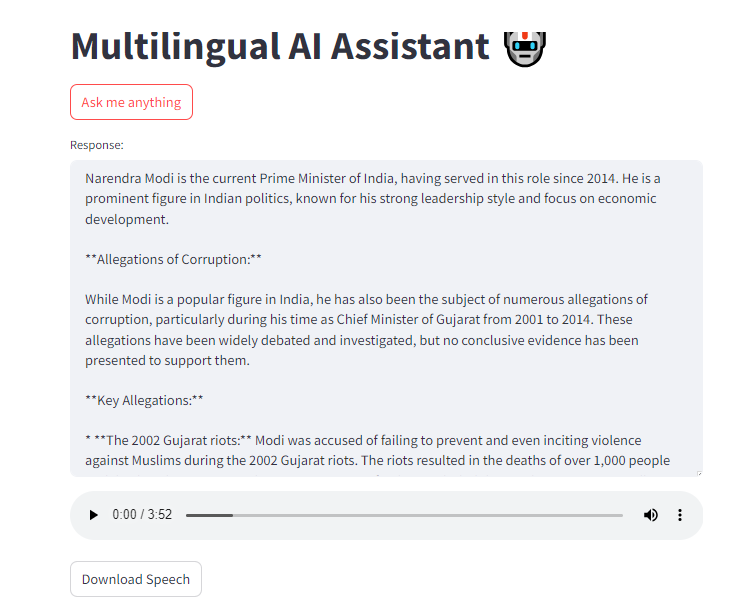

# Multilingual AI Assistant

# Introduction

The **Multilingual AI Assistant** is an advanced voice-driven application powered by the **Gemini-1.5-Flash** model. This project enables users to ask questions in multiple languages and receive intelligent, context-aware answers. It responds not only with **textual output** but also provides a **verbal response** in the form of an **.mp3 file**, making the interaction more dynamic and engaging.

To ensure scalability and reliability, the assistant is deployed on an **AWS EC2 instance**, allowing seamless access and efficient handling of requests. This deployment helps in leveraging cloud infrastructure for high availability and faster response times, making it ideal for real-world applications.

# Features

* **Multilingual Support**: The assistant can process and respond to queries in various languages, making it accessible to a global audience.
* **Voice Input**: Users can interact with the assistant via speech, creating a more natural and intuitive user experience.
* **Text and Audio Output**: Responses are provided both as written text and in an **.mp3** audio format, enhancing usability.
* **Powered by Gemini-1.5-Flash**: This model ensures fast and accurate responses, optimized for performance in multilingual contexts.
* **Cloud Deployment**: The application is deployed on an **AWS EC2** instance for robust cloud performance, handling multiple user queries with minimal latency.

## Tech Stack Used
1) Python
2) Streamlit
3) GeminiAI (Gemini-1.5-Flash)

## Infrastructure
1) GitHub
2) AWS Elastic Container Registry (ECR)

## Installation
    
The Code is written in Python 3.10.19. If you don't have Python installed you can find it here. If you are using a lower version of Python you can upgrade using the pip package, ensuring you have the latest version of pip.

## Run Locally

### Step 1: Clone the repository
```bash
git clone https://github.com/jatin-12-2002/Multilingual_AI_Assistant_Project
```

### Step 2- Create a conda environment after opening the repository
```bash
conda create -p env python=3.10 -y
```
```bash
source activate ./env
```

### Step 3 - Install the requirements
```bash
pip install -r requirements.txt
```

### Step-4: Set up environment variables:
- Create a .env file in the project directory.
- Define the necessary environment variables such as database connection strings, API keys, etc.
- My .env file is [here](https://drive.google.com/file/d/1HadmVnwU_LLi_XvA9ci9MHFLsq_p3Y3o/view?usp=sharing)

### Step-5: Run the streamlit application:
```bash
    streamlit run app.py
```

## Prediction Outputs



## AWS DEPLOYMENT

### Step-1: Push your entire code to github.
### Step-2: Login to your AWS account Link.
### Step-3: Launch your EC2 Instance.
### Step-4: Configure your EC2 Instance. Use t2.large or greater size instances only as it is a LLM project.
### Step-5: Start typing the commands for configuring EC2 Instance.
### INFORMATION: sudo apt-get update and sudo apt update are used to update the package index on a Debian-based system like Ubuntu, but they are slightly different in terms of the tools they use and their functionality:
### Step-6: Connect your EC2 Instance and start typing the following commands

### Step-7: This command uses apt-get, the traditional package management tool.
```bash
    sudo apt-get update
```

### Step-8: This command uses apt, a newer, more user-friendly command-line interface for the APT package management system.
```bash
    sudo apt update -y
```

### Step-9: Install required tools.
```bash
    sudo apt install git curl unzip tar make sudo vim wget -y
```

### Step-10: Clone git repository.
```bash
    git clone https://github.com/jatin-12-2002/Multilingual_AI_Assistant_Project
```

### Step-11: Create a .env file there.
```bash
    touch .env
```

### Step-12: Open file in VI editor.
```bash
    vi .env
```
### Press insert and Mention "GOOGLE API KEY" env variable then press esc for saving and write :wq for exit.
### cat .env #for checking the value

### Step-13: For installing python and pip here is a command
```bash
    sudo apt install python3-pip
```
### Step-14: installs the necessary development libraries for PortAudio and Python.
```bash
sudo apt-get install portaudio19-dev python3-dev
```

### Step-15: install the requirements.txt. The --break-system-packages flag in pip allows to override the externally-managed-environment error and install Python packages system-wide.
```bash
    pip3 install -r  requirements.txt --break-system-packages
```

### The --break-system-packages flag in pip allows to override the externally-managed-environment error and install Python packages system-wide. pip install package_name --break-system-packages


### Step-16: Configure your inbound rule:
1. Go inside the security
2. Click on security group
3. Configure your inbound rule with certain values
4. Port 8501 0.0.0.0/0 for anywhere traffic TCP/IP protocol

### Step-17: Save it and now run your application.
```bash
    python3 -m streamlit run app.py
```

### Step 18 - Run the Public Port of EC2 Instance
```bash
Public_Address:8501
```

### If you encounter any error like code:400 while running "https:{Public_address}:5000" then just run it with 'http' instead of 'https'.


## For more Information you can follow this [document](https://docs.google.com/document/d/1bUonQSpW_T6BZmij80Sa-FbWQszojC6l/edit?usp=sharing&ouid=108540473432270728768&rtpof=true&sd=true) and [video](https://youtu.be/VfG2YV1pCO0?feature=shared).

## Conclusion 

* The **Multilingual AI Assistant** leverages advanced language models and cloud infrastructure to deliver real-time, intelligent responses in **multiple languages**.
* By providing both text and audio outputs, the assistant enhances accessibility and user interaction, making it ideal for diverse use cases.
* Deployed on **AWS EC2**, the application ensures scalability, low latency, and efficient handling of user queries in a production-ready environment.
